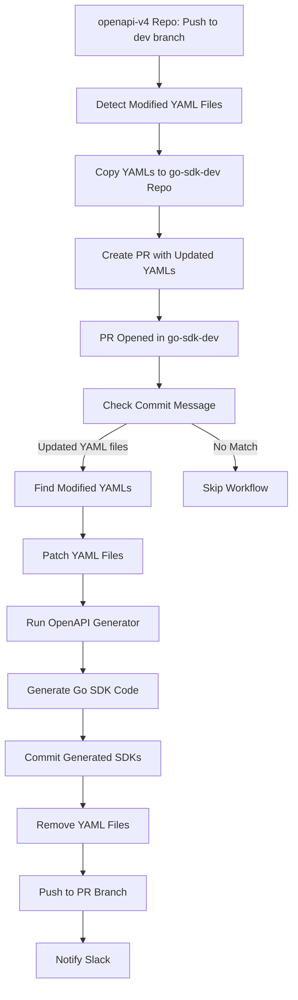

# Deployment Flow

## Flow Overview

### Stage 1: openapi-v4 Repository
- **Trigger**: Push to `dev` branch
- **Action**: Detects modified YAML files and copies them to `azionapi-v4-go-sdk-dev`
- **Output**: Creates PR with updated YAML files

### Stage 2: go-sdk-dev Repository
- **Trigger**: PR opened/synchronized
- **Validation**: Checks commit message matches "Updated YAML files"
- **Generation**: 
  - Patches YAML files
  - Runs OpenAPI Generator for each modified YAML
  - Generates Go SDK code
- **Cleanup**: Removes YAML files after generation
- **Notification**: Sends Slack notification with PR link
